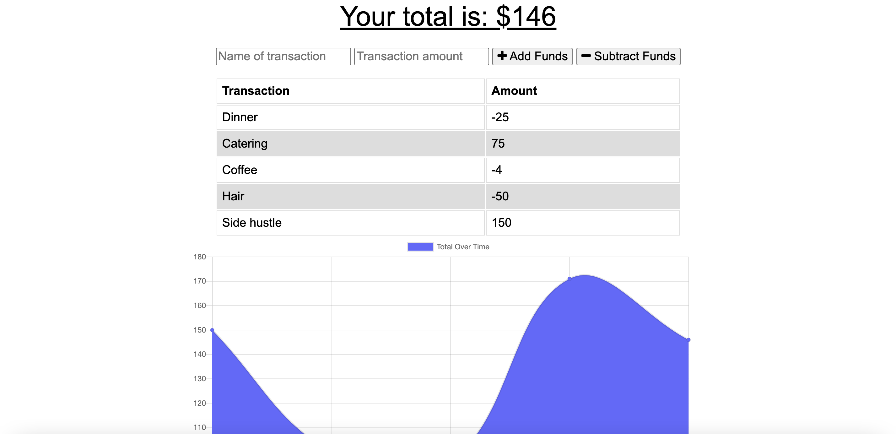

# Budget Tracker

---------------

## *Table of Contents*
- [Description](#description)
- [Installation](#installation)
- [Technologies](#technologies)
- [Contributing](#contributing)
- [Author](#author)

---------------

## *Description*
This application is designed to help allow a user to easily track their balance whether they are online or offline. When the app is offline, the transactions will be cached until the app is back online. Once back online, the transactions will be applied to the total.

---------------

## *Installation*
npm install

---------------

## *Technologies*
- Mongoose
- Express
- MongoDB
- jQuery

---------------

## *Contributing*
Please use a new branch before contributing

---------------

## *Author*
- Hanna Munoz
- [Github](https://github.com/hannamunoz)
- [LinkedIn](https://www.linkedin.com/in/hanna-munoz-179993b2/)

---------------

This project is MIT licensed